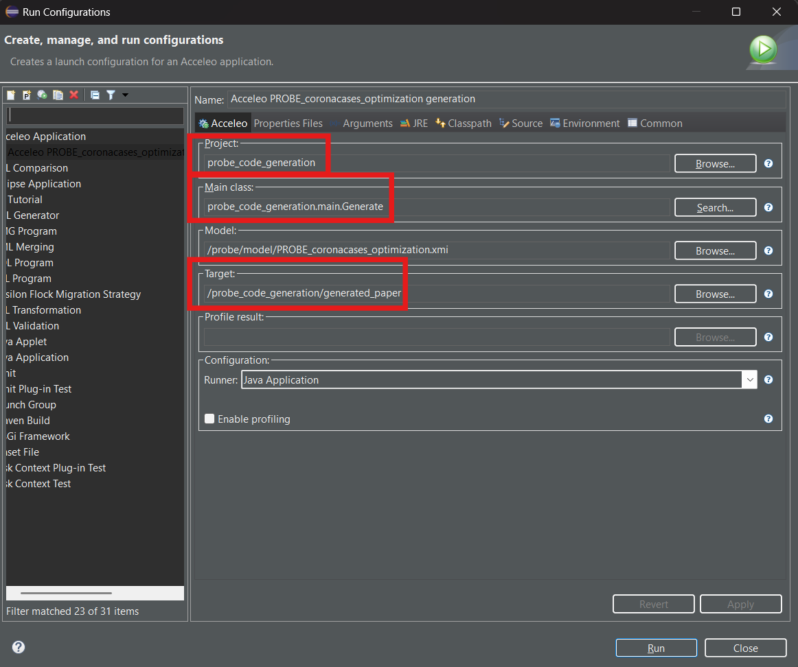

# PROBE Code Generation Project

This project contains the Acceleo code generation project with the code transformations in the mtl file `/PROBE_code_generation/src/PROBE_Acceleo_code_generation/main/generate.mtl`.

## Table of Contents

1. [Workspace Configuration](#workspace-configuration)
2. [Code Generation](#code-generation)
3. [Project Structure](#project-structure)
4. [Citing This Work](#citing-this-work)

## Workspace Configuration

To work with this project, you need to install the Eclipse IDE for Java Developers and the Eclipse Modeling Tools package, as well as in the [PROBE Metamodel and Model Project](../PROBE/README.md). You can download it from the [Eclipse Downloads page](https://www.eclipse.org/downloads/). Aditionally, you need to install the Acceleo plugin for Eclipse. You can do this in Eclipse IDE by going to `Help` > `Eclipse Marketplace...` and searching for "Acceleo". After installing the Acceleo plugin, you can import this project into your workspace by following these steps:

1. Open Eclipse IDE.
2. Go to `File` > `Import...`.
3. Select `Projects from Folder or Archive` and click `Next`.
4. Browse to the location of this project and select the `PROBE_code_generation` folder and click `Finish`.
5. (Optional) If not done yet, right-click on the project in the Project Explorer and select `Configure` > `Convert to Acceleo Project`.

## Code Generation

To generate the code from the Acceleo project, follow these steps:

1. Right-click on the `PROBE_code_generation` project in the Project Explorer.
2. Select `Run As` > `Launch Acceleo Application`.
3. In the dialog that appears, select the model file you want to use for code generation (e.g., `PROBE_coronacases_optimization.xmi` from the `PROBE/model` folder), filling the other fields the same way it is shown in the following image:
   




4. Click `Apply` and then `Run`.
5. The generated code will be placed in the folder the user has specified in the `Target` field of the dialog, which is `python_application/generated_paper` by default.


## Project Structure

The project is structured as follows:

```
phd2_code/
└── PROBE_code_generation/            # Acceleo code generation project
    ├── src/
    │   └── PROBE_Acceleo_code_generation/
    │       └── main/
    │           └── generate.mtl      # Code transformations
    └── README.md                     # Project documentation
```


If you have any questions or suggestions, feel free to contact us.

## Citing This Work

If you use this work in your research, please cite us with the following BibTeX entry:

```
@phdthesis{gutierrez2025,
  author       = {Juan Diego Gutiérrez Gallardo},
  title        = {PROBE: un metamodelo software para explorar los límites de los modelos fundacionales de segmentación de imágenes aplicados al dominio médico},
  school       = {Universidad de Extremadura},
  year         = {2025},
  address      = {Cáceres, España},
  month        = {jul},
  type         = {Tesis Doctoral},
  note         = {Dirigida por Dr. Roberto Rodríguez Echeverría y Dr. José María Conejero Manzano},
  url          = {https://github.com/andyuex/phd2_code},
  abstract     = {Esta tesis doctoral presenta PROBE, un metamodelo software para explorar los límites de rendimiento de modelos fundacionales de segmentación de imágenes mediante técnicas de optimización de prompts. La investigación se centra en el uso del modelo Segment Anything Model (SAM) en tareas de segmentación médica sin necesidad de reentrenamiento, proponiendo una metodología para cuantificar el techo de rendimiento alcanzable mediante algoritmos genéticos. A partir de casos de uso con imágenes médicas (CT, rayos X, MRI), se construye un marco formal que permite sistematizar el uso eficiente de estos modelos en escenarios de recursos limitados. Como contribuciones, se incluyen tres artículos científicos, artefactos software publicados en GitHub, un metamodelo reutilizable y validación empírica del enfoque propuesto.},
  keywords     = {modelos fundacionales, segmentación de imágenes médicas, prompts, SAM, algoritmos genéticos, metamodelos, inteligencia artificial médica},
  language     = {Spanish}
}
```
