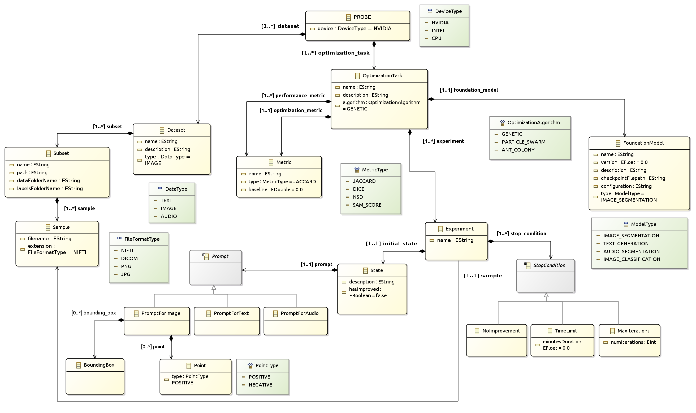

# [Thesis Title]

This project contains the code projects for the thesis titled "[Thesis Title]". The code is organized into the following directories: each one corresponding to a different project nature:

- `probe` - Contains the Eclipse EMF project with the `probe.ecore` metamodel, its graphical clas diagram visualization `probe.aird` and its model XML instance file `probe/model/PROBE_coronacases_optimization.xmi`. You can find the metamodel and model instructions in the [README.md](probe/README.md) file.


- `probe_code_generation` - Contains the Acceleo code generation project with the code transformations in the mtl file `probe_code_generation/src/probe_Acceleo_code_generation/main/generate.mtl`. You can find the code generation instructions in the [README.md](probe_code_generation/README.md) file.


- `python_application` - Contains the Python application that uses the generated code from Acceleo and the static one. The main script is located at `python_application/ProbeDemo.py`. You can find the Python application instructions in the [README.md](python_application/README.md) file.

## Table of Contents

1. [PROBE Metamodel](#probe-metamodel)
2. [Project Structure](#project-structure)
3. [Citing This Work](#citing-this-work)

## PROBE Metamodel

You can appreciate the metamodel of the PROBE project in the following image:




## Project Structure

The project is structured as follows:

```
phd2_code/
├── probe/                             # Eclipse EMF project
│   ├── metamodel/
│   │   ├── probe.aird                 # Graphical visualization
│   │   └── probe.ecore                # Metamodel definition
│   ├── model/                         # Model folder
│   │   └── PROBE_coronacases_optimization.xmi  # Example model
│   └── README.md                      # Project documentation
│
├── probe_code_generation/             # Acceleo code generation project
│   ├── src/
│   │   └── probe_Acceleo_code_generation/
│   │       └── main/
│   │           └── generate.mtl       # Code transformations
│   └── README.md                      # Project documentation
│
├── python_application/                # Python application
│   ├── generated_code/                # Generated code from Acceleo
│   │   ├── enumerations/              # Enumerations
│   │   ├── model/                     # Model classes
│   │   └── PROBEDemo.py              # Main script for the demo
│   │
│   ├── static_code/                   # Static code
│   │   └── ...                        # Interface for the PROBE GUI
│   └── README.md                      # Project documentation
│   
├── resources/                         # Resources folder
│   └── images/                        # Images used in the project
│
├── .gitignore                         # Git ignore file
├── .pre-commit-config.yaml            # Pre-commit configuration file
├── CITATION.cff                       # Citation file for the project
├── README.md                          # General repository documentation
├── requirements.txt                   # Python package requirements
└── TODO                               # Project license
```

## Citing This Work

If you use this work in your research, please cite us with the following BibTeX entry:

```
@ARTICLE{gutierrez25,
  author={Gutiérrez, Juan D. and Delgado, Emilio and Breuer, Carlos, Conejero, José M., and Rodriguez-Echeverria, Roberto},
  journal={Algorithms},
  title={Prompt Once, Segment Everything: Leveraging SAM 2 Potential for Infinite Medical Image Segmentation With a Single Prompt},
  year={2025},
  volume={},
  number={},
  pages={1-1},
  doi={10.1000/182}}

```
