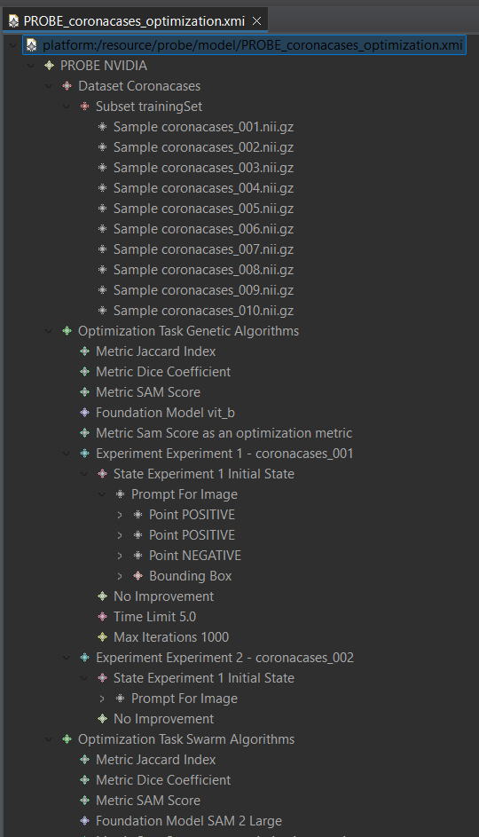

# PROBE Metamodel and Model Project

This project contains the Eclipse EMF project with the `probe.ecore` metamodel and its graphical visualization `probe.aird` and model `/probe/model/PROBE_coronacases_optimization.xmi` model.

## Table of Contents

1. [Workspace Configuration](#workspace-configuration)
2. [Metamodel and Model definition](#metamodel-and-model-definition)
3. [Project Structure](#project-structure)
4. [Citing This Work](#citing-this-work)

## Workspace Configuration

To work with this project, you need to install the Eclipse IDE for Java Developers and the Eclipse Modeling Tools package. You can download it from the [Eclipse Downloads page](https://www.eclipse.org/downloads/). After installing Eclipse, you can import this project into your workspace by following these steps:

1. Open Eclipse IDE.
2. Go to `File` > `Import...`.
3. Select `Projects from Folder or Archive` and click `Next`.
4. Browse to the location of this project and select the `probe` folder and click `Finish`.
5. (Optional) If not done yet, right-click on the project in the Project Explorer and select `Configure` > `Convert to Modelling Project`.

## Metamodel and Model definition

You can appreciate the metamodel of the PROBE project in the following image:


The metamodel is defined in the `probe.ecore` file, and the graphical visualization is provided in the `probe.aird` file. The example model instance is located in the `model` folder as `PROBE_coronacases_optimization.xmi`.
In the following image, you can see the graphical representation of the probe example model:



## Project Structure

The project is structured as follows:

```
phd2_code/
└── probe/                                      # Eclipse EMF project
    │
    ├── metamodel/
    │   ├── images/                             # Images used in the metamodel
    │   ├── probe.aird                          # Graphical visualization
    │   └── probe.ecore                         # Metamodel definition
    │
    ├── model/                                  # Model folder
    │   └── PROBE_coronacases_optimization.xmi  # Example model
    │
    └── README.md                               # Project documentation
```

## Citing This Work

If you use this work in your research, please cite us with the following BibTeX entry:

```
@ARTICLE{gutierrez25,
  author={Gutiérrez, Juan D. and Delgado, Emilio and Breuer, Carlos, Conejero, José M., and Rodriguez-Echeverria, Roberto},
  journal={Algorithms},
  title={Prompt Once, Segment Everything: Leveraging SAM 2 Potential for Infinite Medical Image Segmentation With a Single Prompt},
  year={2025},
  volume={},
  number={},
  pages={1-1},
  doi={10.1000/182}}

```
